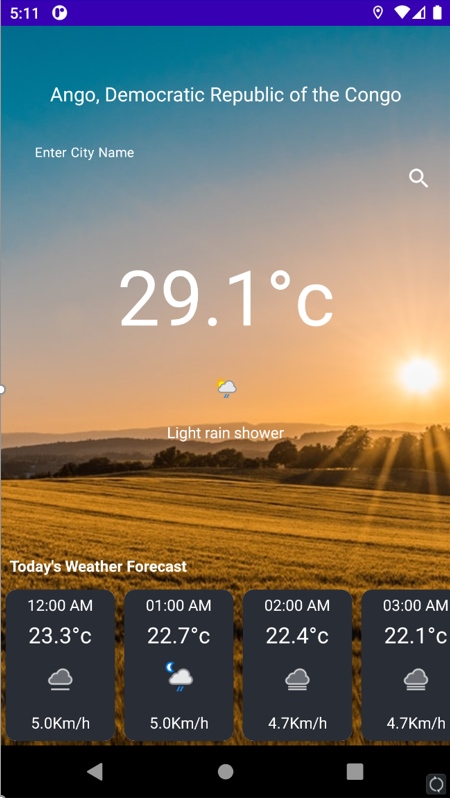
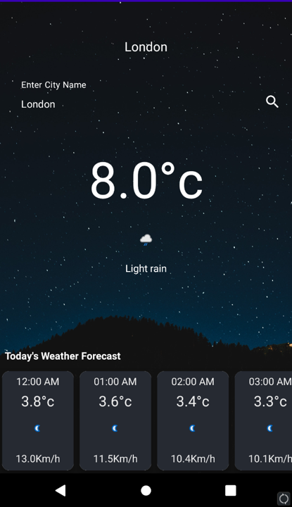

# mobile-weather-app

* Functional requirements
  * Location
  * Requesting permission to access your location
  * Check the weather status in any city
  * Display the current weather in a city
  * Display of the weather hour by hour
  * Dynamic download of icons depending on the weather
  * Description of the weather status
  * Changing the background according to the time
* App presentation

